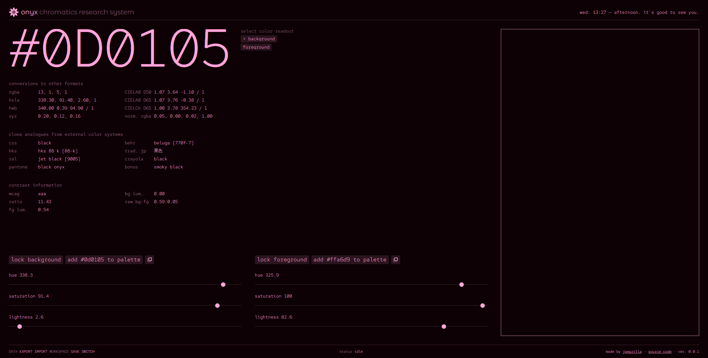

<h1></h1>

onyx is a color tool made for software designers and developers &mdash; people who make websites, apps, video games, and anything else that uses color.

the purpose of onyx is to provide you with a way to easily create and generate custom color palettes that you can use in a variety of contexts. onyx can be your full service color tool for any kind of chromatics-related research and development.

designing an app and need some color inspiration? onyx can do that. want to convert colors from one format to another? onyx does that too! the list goes on &mdash; you'll never need another color app.

onyx was created with the comfort and enjoyment of the user in mind.

## (indev) screenshots

## development

while onyx is still in development, you can run it by downloading this repository and running [serve](https://www.npmjs.com/package/serve) or something like `python3 -m http.server` in the directory.

## features

-   convert colors into a variety of different formats
-   get data on similar colors from other palettes, such as pantone, behr, and crayola
-   offline-first - onyx doesn't store your data online, so you always have access and control

## (upcoming) features

**onyx is still in development - features are incomplete.**

-   three color selector control modes &mdash; choose between hsl, rgb, and hex
-   generate full palettes with the click of a button &mdash; with fine-tuned generation options
-   create palettes one color at a time for maximum freedom
-   see what your colors will look like on a rendered 3-dimensional shape
-   export palettes for adobe products, css code, and more
-   export and share palettes with other people who use onyx
-   create custom color workspaces to separate your palettes per project
-   drag and drop controls makes creating and organizing palettes easier
-   simulate color different types of color blindness with your palettes

### contributing

_... tbd_

### also maybe coming

-   yiq, ycbcr, y'uv color
-   cieluv
-   customizable keyboard shortcuts
-   create palette from image

### todo

-   jsdoc literally everything
-   add ui tests
-   add performance tests