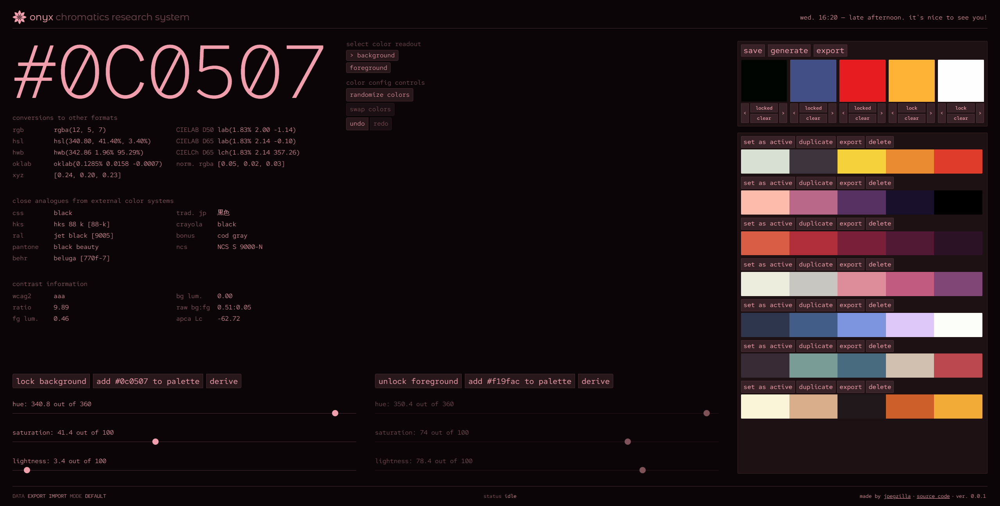
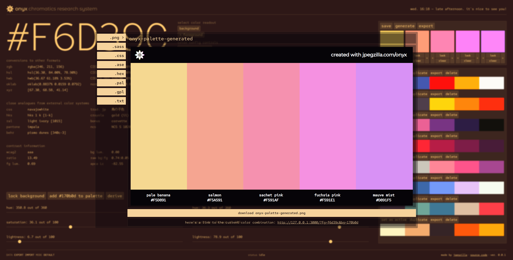

<h1></h1>

onyx is a color tool made for software designers and developers &mdash; people who make websites, apps, video games, and anything else digital that uses color.

the purpose of onyx is to provide you with a way to easily create and generate custom color palettes that you can use in a variety of contexts. onyx can be your full service color tool for any kind of digital chromatics-related research and development.

designing an app and need some color inspiration? onyx can do that. want to convert colors from one format to another? onyx does that too! the list goes on &mdash; you'll never need another color app.\*

onyx was created with the comfort and enjoyment of the user in mind. if you think some feature doesn't feel intuitive, or some workflow is awkward, please let me know. I try to design interfaces that are fun and easy to use!

\***maybe.**

## how to use / download

go to [jpegzilla.com/onyx](https://jpegzilla.com/onyx). if you're on a current version of chrome, edge, or safari, you should be prompted to download onyx as a [pwa](https://en.wikipedia.org/wiki/Progressive_web_app). otherwise, you can't download it &mdash; but you can use the online version as long as you have internet.

if you want to see a demo configuration, take the file in the `/demo` folder of this repository and drag it into onyx. this will overwrite all your data though, so make sure to export your configuration first if you need a backup!

## features

-   convert colors into a variety of different formats
-   get data on similar colors from other palettes, such as pantone, behr, and crayola
-   offline-first - onyx doesn't store your data online, so you always have access and control
-   create and export palettes in several different formats for sharing or use in other software, including adobe software
-   get contrast data in wcag2 and apca forms

## screenshots

## upcoming features

**onyx is still in development - features are incomplete.**

-   three color slider control modes &mdash; choose between hsl, rgb, and lch
-   fine-tune palette generation options
-   see what your colors will look like on a rendered 3-dimensional shape
-   visualize colors in various color spaces
-   create custom color workspaces to separate your palettes per project
-   drag and drop controls makes creating and organizing palettes easier
-   simulate color different types of color blindness with your palettes
-   improved keyboard controls for keyboard-only onyx usage

_also maybe coming..._

-   yiq, ycbcr, y'uv color
-   cieluv
-   customizable keyboard shortcuts
-   create palette from image

## why does this exist?

I use many color tools simultaneously when I'm doing interface design. creating a color palette often means I'll visit [monochrome](https://monochrome.jxnblk.com/), [colorable](https://colorable.jxnblk.com/), [contrast ratio](https://contrast-ratio.com/), [apca contrast calculator](https://www.myndex.com/APCA/), and even [coolors](https://coolors.co/generate).

I wanted to create one complete solution for everything I need when creating interface color palettes. onyx is the next step in my quest to achieve this goal, with the previous step being [emerald](https://jpegzilla.com/emerald).

## development

while onyx is still in development, you can run it by downloading this repository and running [serve](https://www.npmjs.com/package/serve) or something like `python3 -m http.server` in the directory.

### todo

-   jsdoc literally everything
-   add ui tests
-   add performance tests
